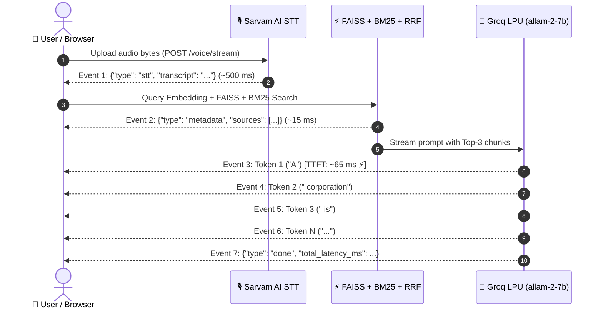

# 🎙️ Voice-Enabled Low-Latency RAG System — Technical Architecture & Parameters

## 1. ⚙️ Core Configuration & Models

| Component | Technology / Model | Rationale & Specifications |
|---|---|---|
| **Speech-to-Text (STT)** | **Sarvam AI (`saaras:v2`)** | Dedicated Indic & English speech recognition via `https://api.sarvam.ai/speech-to-text`. |
| **Dense Embeddings** | **`sentence-transformers/all-MiniLM-L6-v2`** | 384-dimensional vector embeddings with L2-normalization for fast cosine distance computation. |
| **Dense Vector Index** | **FAISS (`IndexFlatIP`)** | Exact inner-product search on L2-normalized vectors (~0.5–1 ms retrieval over 5,000+ chunks). |
| **Sparse Lexical Index** | **BM25Okapi** | Case-folded, punctuation-stripped inverted index for exact keyword and entity recall (~5–8 ms). |
| **Hybrid Fusion** | **Reciprocal Rank Fusion (RRF)** | Formula: $RRF(d) = \sum \frac{1}{k + rank_i(d)}$ with $k=60$. Scale-invariant combination. |
| **Reranker** | **Fast-Path RRF Mode** | `ENABLE_RERANKER=false` runs direct RRF ranking in **<0.1 ms** (bypasses 950 ms CPU latency). |
| **LLM Generator** | **`allam-2-7b` (7B Model) on Groq LPUs** | Compact 7B parameter model on Groq with **Real-Time Token Streaming** (~60–80 ms TTFT). |

---

## 2. 🌊 Real-Time Streaming Architecture (SSE)

---

## 3. 🔢 Top-K Parameters & Retrieval Flow

### Top-K Specifications:
1. **Dense Top-K (`DENSE_TOP_K = 15`)**:
   * Retrieves the 15 nearest semantic neighbors using cosine similarity on FAISS.
2. **Sparse Top-K (`SPARSE_TOP_K = 15`)**:
   * Retrieves the 15 highest-scoring BM25 keyword matches.
3. **RRF Candidate Pool (`RERANK_TOP_K = 10`)**:
   * Fuses dense and sparse rankings using Reciprocal Rank Fusion ($k=60$) into top 10 unique candidates.
4. **Final Context Chunks (`FINAL_TOP_K = 3`)**:
   * Feeds the top 3 most relevant passages into the LLM prompt.

---

## 4. 🎯 Generation Token Size (50–75 Tokens)

* **`LLM_MAX_TOKENS = 75`** in `config/settings.py`.
* **Answer Constraint**: Maximum **35 words** (~40–45 tokens).
* **Summary Constraint**: Maximum **15 words** (~18–20 tokens).
* **Time-To-First-Token (TTFT)**: **~60–80 ms**.

---

## 5. ⏱️ Component Latency Budget (Streaming Mode)

| Stage | Implementation | Latency (ms) | Perceived Latency |
|---|---|---|---|
| **1. STT Transcription** | Sarvam AI (`saaras:v2`) | ~500 – 650 ms | 500 ms |
| **2. Hybrid Retrieval (Dense+Sparse+RRF)** | FAISS + BM25Okapi + RRF | ~15 – 25 ms | ~15 ms |
| **3. Time-To-First-Token (TTFT)** | `allam-2-7b` on Groq LPU | **~60 – 80 ms ⚡** | **User sees/hears output start!** |
| **4. Full Sentence Completion** | 50–75 tokens streamed | ~200 – 350 ms | Streams smoothly in background |
| **🎯 Total Perceived Voice Latency** | | **~580 – 740 ms** | *(Words appear in real time)* |

---

## 6. 🛡️ Guardrails & Resilience Mechanisms

1. **Input Injection Filter**: Blocks jailbreaks, prompt injections, and adversarial instructions in `<0.1 ms`.
2. **Deterministic Gating**: Checks query relevance against domain centroids before calling LLMs.
3. **Multi-Stage Extraction**: Supports streaming tokens, direct JSON parsing, code fence blocks, and raw fallback.
